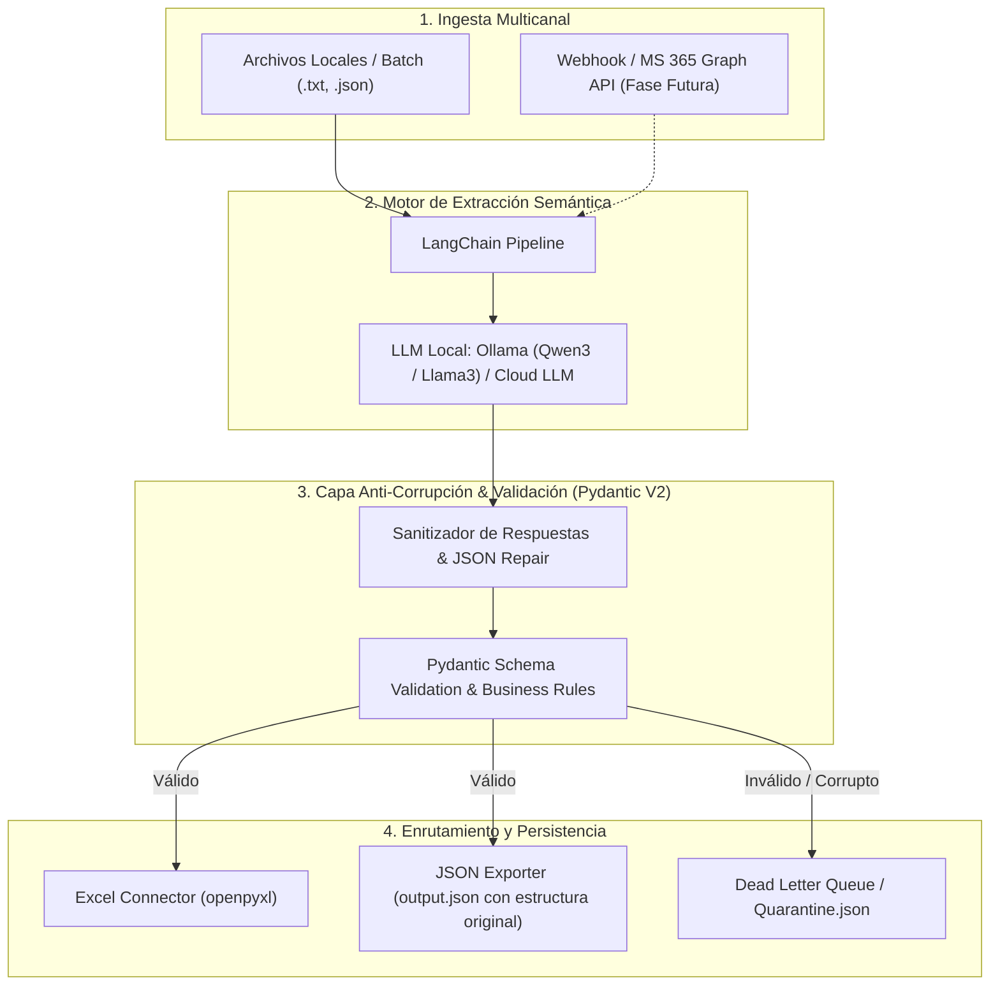

# Entregable 2: Arquitectura de Automatización E2E y Prevención de Corrupción de Datos

## 1. Visión General y Diagrama de Arquitectura

El objetivo del sistema es transformar reportes operativos no estructurados (correos/chats de supervisores de moldeo) en registros de producción limpios, validados y consolidados en **Excel** y **Smartsheet**, eliminando la captura manual y previniendo la corrupción de datos.



---

## 2. Stack Técnico Recomendado

* **Lenguaje & Entorno**: Python 3.10+ administrado con Poetry.
* **Orquestación & LLM Framework**: LangChain Core / LangChain Ollama con soporte estructurado.
* **Modelos de IA**:
  * *Entorno Local / On-Premise*: Ollama ejecutando `qwen3:8b` o `llama3:8b` (privacidad total, sin costo por token, baja latencia en planta).
  * *Entorno Cloud (Opcional)*: Claude 3.5 Haiku o GPT-4o-mini mediante adaptadores estándar de LangChain.
* **Capa de Validación y Tipado**: **Pydantic V2** para validación estricta de esquemas y reglas de negocio en memoria.
* **Conectores de Datos**:
  * `openpyxl`: Generación y mantenimiento de libros Excel operacionales con formato condicional y fórmulas.
  * `smartsheet-python-sdk` / `requests`: Comunicación segura con la API de Smartsheet.
* **Interfaz Operativa**: CLI interactiva y de procesamiento en lote desarrollada con `Rich`.

---

## 3. Estrategias de Prevención de Errores y Anti-Corrupción

Para garantizar que ningún dato erróneo o alucinación del modelo contamine los reportes oficiales, se implementa una arquitectura defensiva en 5 capas:

1. **Schema Enforcement & Coerción Tipográfica (Pydantic V2)**:
   * **Tipos y Rangos Estrictos**: Los campos numéricos (`downtime_minutes`, `approved_parts`, `rejected_parts`) tienen restricción `ge=0`. No se permiten valores negativos.
   * **Normalización de Identificadores**: Expresiones regulares forzan identificadores consistentes (ej. `"maq 102"` $\rightarrow$ `"M102"`).
   * **Validación de Relaciones Numéricas**: El sistema calcula `total_parts = approved_parts + rejected_parts` y la tasa de scrap automáticamente, evitando discrepancias aritméticas generadas por el LLM.

2. **Auto-Healing & Sanitización de Salida**:
   * Los LLMs ocasionalmente envuelven respuestas en bloques Markdown (```` ```json ````) o agregan texto de cortesía. El módulo `sanitize_json_response` extrae el payload JSON limpio y repara envoltorios antes de entregarlo al validador.

3. **Detección Automática de Anomalías Operativas**:
   * Si la tasa de scrap excede el 5% o el paro de máquina supera los 60 minutos, el registro se marca con bandera de alerta (`has_anomaly = True`) y se estila con color de advertencia en Excel, requiriendo validación por el jefe de planta.

4. **Aislamiento en Cuarentena (Dead Letter Queue - DLQ)**:
   * Si un correo contiene texto ininteligible o falla la validación estructural, **el proceso no se detiene ni corrompe el reporte final**. La entrada fallida se aísla en `quarantine.json` con timestamp y mensaje de error para auditoría humana.

5. **Idempotencia y Trazabilidad**:
   * Cada fila insertada en Smartsheet y Excel incluye el nombre del archivo de origen y la marca de tiempo de extracción (`processed_at`), evitando duplicidades en reprocesamientos.

---

## 4. Hoja de Ruta para Integración en Producción (Próximos Pasos)

* **Fase Actual (Implementada)**: Ingesta por archivos locales (`.txt`, `.eml`, `.json`), validación estricta con Pydantic, extracción con Ollama/Qwen3 y exportación a Excel y JSON estructurado (`output.json` con la especificación original).
* **Fase Siguiente**: Conectar un Webhook en FastAPI o un listener de Microsoft Graph API / IMAP para recibir automáticamente los correos de la bandeja de entrada de producción en tiempo real.
