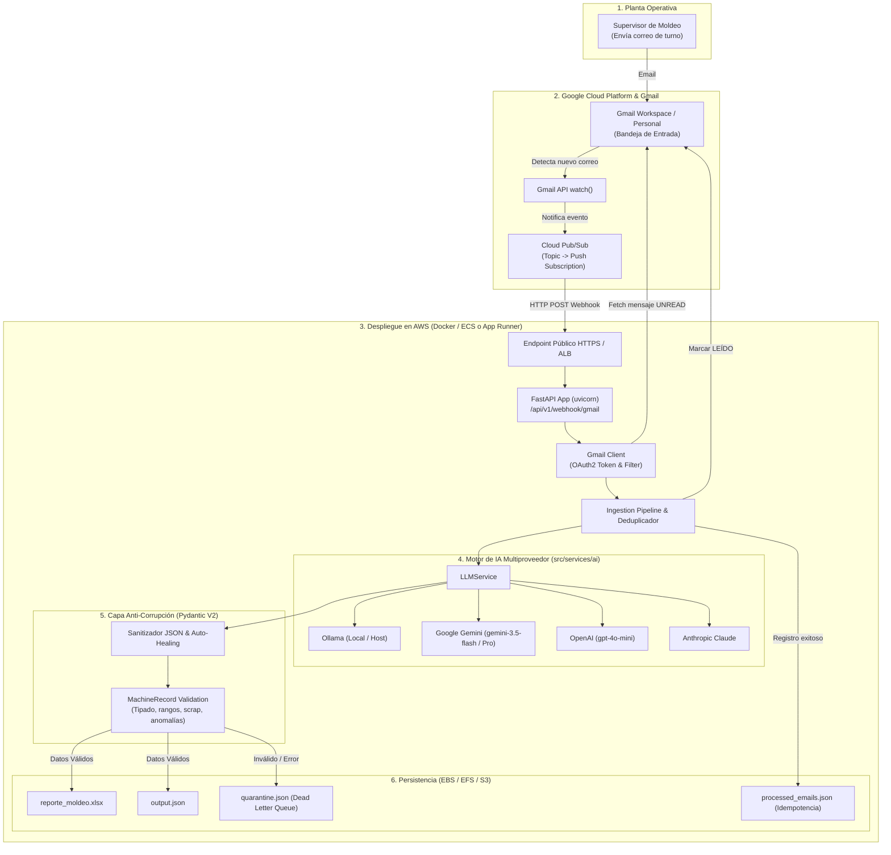
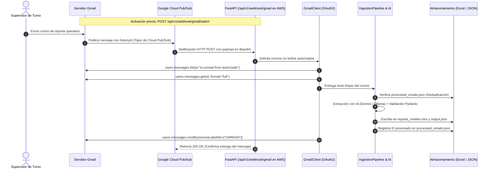
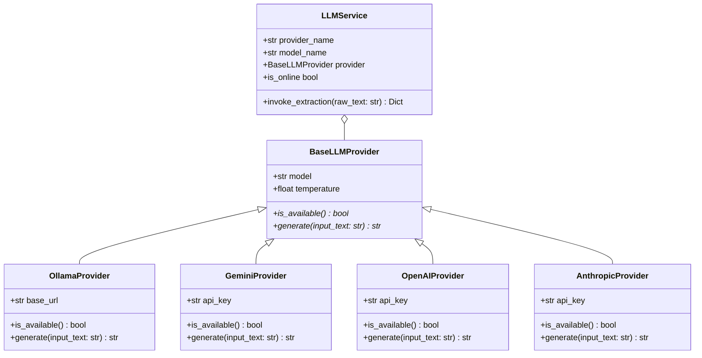
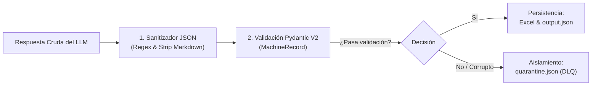

# Arquitectura Integral E2E: RAG for Mails

Este documento describe la arquitectura técnica completa del sistema **RAG for Mails**: desde el despliegue en la nube (**AWS**), la ingesta de correos mediante **Gmail API & Google Cloud Pub/Sub (watch)**, la orquestación multiproveedor de **Inteligencia Artificial**, la validación estricta con **Pydantic V2**, hasta la persistencia y prevención de corrupción de datos.

---

## 1. Visión General del Sistema

El objetivo central del sistema es procesar reportes operativos no estructurados (enviados por correo electrónico por jefes de turno en plantas de moldeo por inyección de plástico), extraer sus métricas clave sin errores humanos ni alucinaciones, y sincronizarlos en tiempo real hacia libros oficiales en **Excel** y **JSON**.



---

## 2. Infraestructura y Despliegue en la Nube (AWS)

La aplicación está completamente dockerizada mediante un [`Dockerfile`](../Dockerfile) multinivel basado en `python:3.12-slim-bookworm` y Poetry, lista para ser desplegada en **AWS** con alta disponibilidad:

### Opciones de Despliegue en AWS
1. **AWS App Runner (Opción Rápida & Serverless)**:
   - Se compila la imagen Docker y se publica en **AWS ECR (Elastic Container Registry)**.
   - App Runner despliega el contenedor asignándole automáticamente un dominio público con certificado **HTTPS**, ideal para recibir los webhooks de Google Cloud Pub/Sub.
2. **AWS ECS Fargate + Application Load Balancer (Producción Escalable)**:
   - Despliegue serverless de contenedores en tareas Fargate.
   - El ALB termina el tráfico TLS y redirige las peticiones al contenedor en el puerto `8000`.
3. **Gestión de Secretos y Configuración**:
   - Las variables sensibles del archivo `.env` (`GEMINI_API_KEY`, `OPENAI_API_KEY`, credenciales OAuth) se inyectan en tiempo de ejecución a través de **AWS Secrets Manager** o **AWS Systems Manager Parameter Store**.
4. **Persistencia de Archivos**:
   - Los archivos generados (`data/output/reporte_moldeo.xlsx` y `output.json`) se montan sobre volúmenes persistentes **AWS EFS** o se sincronizan periódicamente hacia buckets de **AWS S3**.

---

## 3. Ingesta Orientada a Eventos: Webhook Gmail API & `watch()`

En lugar de implementar consultas periódicas ineficientes (*polling*), el sistema opera de forma reactiva en tiempo real (*Event-Driven*):



### Componentes Clave del Flujo de Correo:
1. **Registro del Watch (`POST /api/v1/webhook/gmail/watch`)**:
   - Llama a `gmail.users().watch()` vinculando el buzón al Topic de Cloud Pub/Sub.
2. **Push Subscription en Cloud Pub/Sub**:
   - Configurada con el endpoint público HTTPS de AWS: `https://<tu-dominio-aws>/api/v1/webhook/gmail`.
   - Responde inmediatamente con `200 OK` tras procesar para evitar reenvíos cíclicos.
3. **Filtro de Seguridad por Remitente**:
   - `GMAIL_AUTHORIZED_SENDER` descarta correos de remitentes ajenos a la operación de la planta.
4. **Idempotencia y Trazabilidad**:
   - `ProcessedTracker` almacena los `email_id` procesados en `processed_emails.json`. Si Pub/Sub envía una notificación repetida, el correo se omite inmediatamente sin duplicar filas en Excel.
5. **Cierre de Ciclo**:
   - Tras la extracción y persistencia exitosa, se elimina la etiqueta `UNREAD` del correo en Gmail.

---

## 4. Motor de IA Multiproveedor (`src/services/ai/`)

El sistema cuenta con una capa de abstracción desacoplada para modelos de lenguaje, permitiendo alternar indistintamente entre inferencia local o proveedores en la nube:



### Características Principales:
1. **Configuración Centralizada en `.env`**:
   - Cada proveedor tiene preestablecido su modelo exacto y su credencial:
     - **Ollama**: `OLLAMA_MODEL=qwen3:8b` (predeterminado local).
     - **Google Gemini**: `GEMINI_MODEL=gemini-3.5-flash` con `GEMINI_API_KEY`.
     - **OpenAI**: `OPENAI_MODEL=gpt-4o-mini` con `OPENAI_API_KEY`.
     - **Anthropic Claude**: `ANTHROPIC_MODEL=claude-3-5-sonnet-20240620`.
2. **Alternancia Dinámica de Modelos en Tiempo de Ejecución**:
   - **`GET /api/v1/ai/models`**: Retorna únicamente el modelo exacto preconfigurado en `.env` para cada proveedor y su estado de disponibilidad.
   - **`POST /api/v1/ai/models`**: Permite cambiar en caliente el proveedor activo con un payload mínimo:
     ```json
     { "provider": "gemini" }
     ```
     El sistema adopta de inmediato el modelo y clave preestablecidos sin requerir reinicio del servidor.
3. **System Prompt de Manufactura Especializado**:
   - Ubicado en `src/services/ai/prompts.py`, contiene instrucciones deterministas de extracción y ejemplos *few-shot* para parsear paros, anomalías de inyección y líderes de turno.

---

## 5. Capa Anti-Corrupción & Validación Estricta con Pydantic V2

Para blindar la base de datos y los reportes de producción contra alucinaciones de la IA o correos mal redactados, se ejecutan filtros defensivos sucesivos:



1. **Auto-Healing & Sanitización de Markdown (`sanitize_json_response`)**:
   - Remueve bloques ```` ```json ````, texto introductorio y caracteres inválidos, extrayendo el JSON puro.
2. **Validación de Tipos y Rangos**:
   - `downtime_minutes`, `approved_parts` y `rejected_parts` exigen enteros mayores o iguales a 0 (`ge=0`).
3. **Cálculo Aritmético Garantizado**:
   - El sistema calcula `total_parts = approved_parts + rejected_parts` y la tasa de scrap en código Python, evitando que el LLM cometa errores de suma.
4. **Detección de Anomalías Operativas**:
   - Marca automáticamente `has_anomaly = True` si el scrap supera el 5% o si el paro excede 60 minutos, alertando a la supervisión.
5. **Aislamiento en Cuarentena (Dead Letter Queue)**:
   - Registros incompletos o defectuosos se desvían a `quarantine.json` con fecha y traza del error, garantizando que el flujo principal nunca se bloquee ni corrompa el archivo Excel maestro.

---

## 6. Persistencia y Exportación

- **Excel (`reporte_moldeo.xlsx`)**: Creado y mantenido mediante `openpyxl`. Aplica formato condicional, encabezados estilizados y agrega nuevas filas de manera atómica e idempotente.
- **JSON Consolidado (`output.json`)**: Mantiene el histórico estructurado de reportes validados.
- **Trazabilidad (`processed_emails.json`)**: Mantiene el registro de auditoría de cada correo procesado (ID, fecha, remitente, asunto).

---

## 7. Resumen de Endpoints de la API

| Endpoint | Método | Propósito |
| :--- | :---: | :--- |
| `/health` | `GET` | Diagnóstico de salud del servicio, proveedor IA activo y archivos |
| `/api/v1/process/text` | `POST` | Procesa texto directo o JSON con opción de sobreescribir proveedor IA |
| `/api/v1/webhook/gmail` | `POST` | Receptor de eventos de Google Cloud Pub/Sub y modo simulación |
| `/api/v1/webhook/gmail/watch` | `POST` | Registra la suscripción `watch()` en Gmail hacia Cloud Pub/Sub |
| `/api/v1/webhook/gmail/stop-watch`| `POST` | Detiene las notificaciones push de Gmail |
| `/api/v1/ai/models` | `GET` | Lista los proveedores y los modelos exactos configurados en `.env` |
| `/api/v1/ai/models` | `POST` | Cambia el proveedor activo en tiempo de ejecución (`{"provider": "gemini"}`) |
