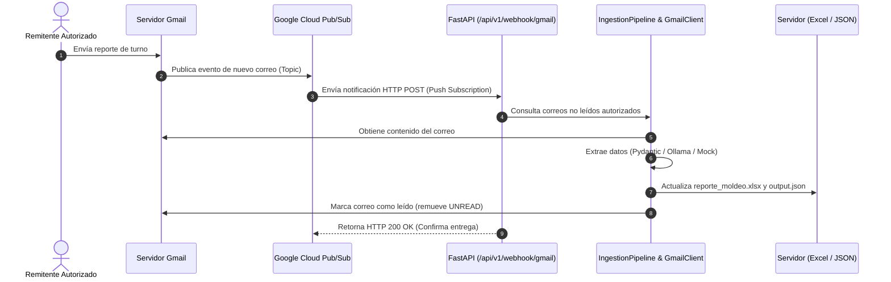

# Especificación y Plan de Integración: Webhook de Gmail y FastAPI

Este documento detalla la arquitectura, el funcionamiento y el procedimiento de configuración del **Webhook de Gmail** implementado en la aplicación FastAPI (`rag-for-mails`).

---

## 1. Arquitectura Orientada a Eventos (Event-Driven)

En lugar de consultar periódicamente la bandeja de entrada (polling manual o por consola), el sistema utiliza una arquitectura basada en eventos mediante **Google Cloud Pub/Sub** y un webhook HTTP en **FastAPI**.



---

## 2. Especificación del Endpoint del Webhook

- **Método**: `POST`
- **Ruta**: `/api/v1/webhook/gmail`
- **Código de Respuesta de Éxito**: `200 OK` (Indispensable para Google Cloud Pub/Sub; cualquier código distinto a `2xx` provocará que Pub/Sub reintente enviar la notificación).

---

## 3. Modos de Operación

El endpoint soporta dos modalidades de funcionamiento:

### A. Modo Simulación Directa (Pruebas Locales)
Permite verificar todo el flujo de extracción, validación y persistencia en el Excel del servidor de forma instantánea sin necesidad de conectar a Google Cloud ni esperar correos reales:

**Petición:**
```json
POST /api/v1/webhook/gmail
Content-Type: application/json

{
  "simulate": true,
  "raw_text": "Actualización Turno 1:\nLa máquina M102 estuvo detenida durante 45 minutos debido a un cambio de molde. Total de piezas aprobadas: 1200. Piezas rechazadas: 15 debido a defectos estéticos.\nLíder de turno: Juan Pérez.",
  "force_mock": true
}
```

**Respuesta:**
```json
{
  "success": true,
  "mode": "simulation",
  "processed_count": 1,
  "details": [
    {
      "machine_id": "M102",
      "downtime_minutes": 45,
      "approved_parts": 1200,
      "rejected_parts": 15,
      "reasons": ["cambio de molde", "defectos estéticos"],
      "shift_leader": "Juan Pérez",
      "shift": "Turno 1"
    }
  ],
  "server_excel_path": ".../data/output/reporte_moldeo.xlsx",
  "message": "Texto simulado procesado y Excel del servidor actualizado correctamente."
}
```

---

### B. Modo Google Cloud Pub/Sub Push (Producción)
Cuando Gmail detecta un nuevo correo, Cloud Pub/Sub entrega el payload estándar con los datos codificados en Base64:

**Petición enviada por Cloud Pub/Sub:**
```json
POST /api/v1/webhook/gmail
Content-Type: application/json

{
  "message": {
    "data": "eEudGVjbm0ubXgiLCAiaGlzdG9yeUlkIjogIjEyMzQ1NiJ9",
    "messageId": "2070443601311540",
    "publishTime": "2026-09-10T12:00:00.000Z"
  },
  "subscription": "projects/tu-proyecto/subscriptions/gmail-push-sub"
}
```

**Procesamiento interno:**
1. Decodifica `message.data` (contiene `emailAddress` y `historyId`).
2. Consulta `GmailClient.fetch_authorized_unread_emails()` filtrando estrictamente por el remitente autorizado (`l23200286@pachuca.tecnm.mx`).
3. Procesa cada correo con `IngestionPipeline`.
4. Añade los registros a `data/output/reporte_moldeo.xlsx` y `data/output/output.json` en el servidor.
5. Marca el mensaje como leído en Gmail (`users().messages().modify(...)`) para evitar duplicidad.
6. Retorna `200 OK`.

---

## 4. Guía de Configuración en Google Cloud para Producción

Para activar las notificaciones push automáticas desde Gmail hacia este webhook:

### Paso 1: Crear el Tema (Topic) en Cloud Pub/Sub
1. Ve a **Google Cloud Console** > **Pub/Sub** > **Topics**.
2. Haz clic en **Create Topic** e ingresa un nombre (ej. `gmail-notifications`).
3. Nombre completo del recurso: `projects/<TU_PROJECT_ID>/topics/gmail-notifications`.

### Paso 2: Otorgar Permisos de Publicación a Gmail
1. En el Topic recién creado, ve a la pestaña **Permissions**.
2. Haz clic en **Add Principal**.
3. Principal: `gmail-api-push@system.gserviceaccount.com` (cuenta oficial de Google para push notifications).
4. Rol: **Pub/Sub Publisher**.

### Paso 3: Crear la Suscripción Push
1. En el mismo Topic, ve a **Subscriptions** > **Create Subscription**.
2. Tipo de entrega: **Push**.
3. URL del endpoint: `https://<TU_DOMINIO_PUBLICO>/api/v1/webhook/gmail`.
   - *Nota para desarrollo local*: Puedes exponer tu puerto local `8000` con `ngrok` o Cloudflare Tunnel:
     ```bash
     ngrok http 8000
     # URL resultante: https://xxxx.ngrok-free.app/api/v1/webhook/gmail
     ```
4. Confirmación de recepción: Pub/Sub requiere que el endpoint retorne `200 OK` dentro de los 10 segundos.

### Paso 4: Registrar el Listener `watch()` en Gmail API
Para que Gmail empiece a publicar eventos en tu Topic, se realiza una llamada inicial de registro con las credenciales del usuario:
```python
request_body = {
    "labelIds": ["INBOX"],
    "topicName": "projects/<TU_PROJECT_ID>/topics/gmail-notifications"
}
service.users().watch(userId="me", body=request_body).execute()
```
*(Nota: La suscripción `watch()` de Gmail tiene una vigencia de 7 días, por lo que se renueva periódicamente).*

---

## 5. Pruebas Locales Inmediatas

Para probar el webhook localmente sin esperar a la configuración en la nube:

### Con cURL:
```bash
curl -X POST "http://localhost:8000/api/v1/webhook/gmail" \
     -H "Content-Type: application/json" \
     -d '{
       "simulate": true,
       "raw_text": "Turno 1: Máquina M102 estuvo detenida durante 45 min por cambio de molde. Piezas aprobadas: 1200, rechazadas: 15. Líder: Juan Pérez",
       "force_mock": true
     }'
```

### Con la UI interactiva Swagger:
1. Arranca el servidor: `poetry run python main.py`
2. Ve a [http://127.0.0.1:8000/docs](http://127.0.0.1:8000/docs).
3. Selecciona `POST /api/v1/webhook/gmail`.
4. Haz clic en **Try it out**, pega el JSON de simulación y haz clic en **Execute**.
5. Abre `data/output/reporte_moldeo.xlsx` en el servidor para comprobar las nuevas filas agregadas.
