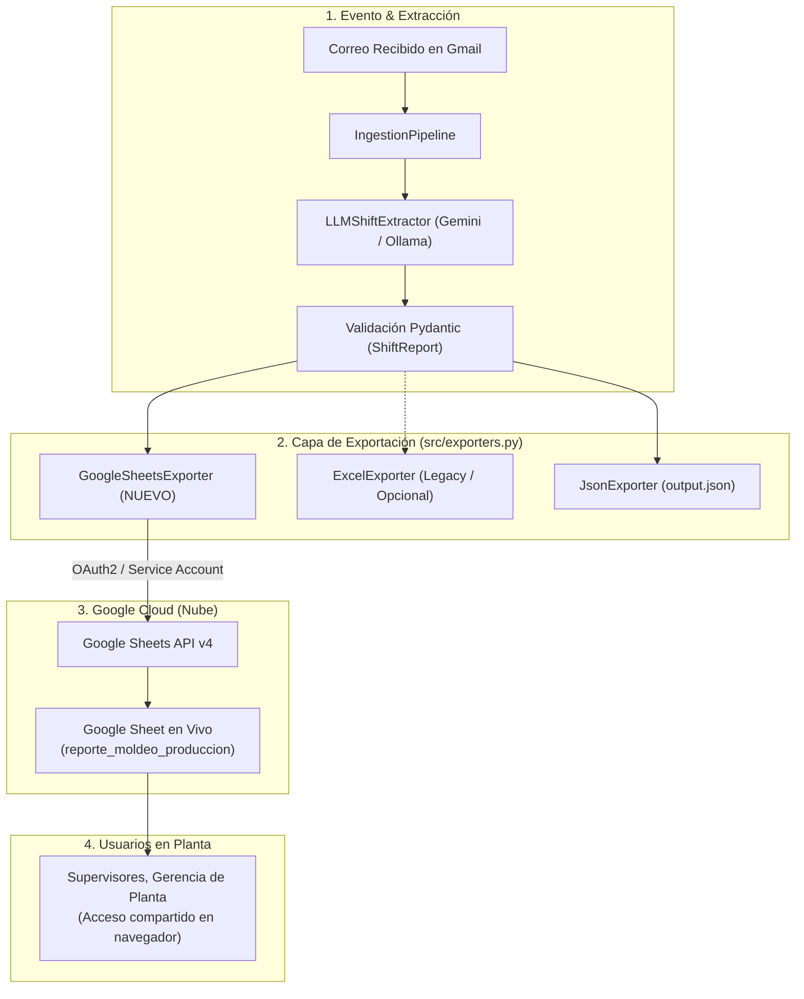

# Plan de Implementación: Migración de Excel (.xlsx) a Google Sheets en Tiempo Real

Este documento contiene la especificación arquitectónica, diseño de componentes y plan de trabajo detallado para que el siguiente agente reemplace (o complemente) la exportación a archivos físicos locales `reporte_moldeo.xlsx` por sincronización automática y en tiempo real con **Google Sheets**.

---

## 1. Justificación y Objetivos de la Migración

### Problemas del Modelo Actual con Excel (.xlsx)
1. **Aislamiento en Contenedores AWS**: El archivo `reporte_moldeo.xlsx` se genera en el disco local (`/app/data/output/`) del contenedor ECS. Para que los supervisores o gerentes lo vean, se requiere montar volúmenes EFS compartidos o descargar el archivo mediante endpoints binarios.
2. **Carencia de Tiempo Real Colaborativo**: El archivo Excel no permite visualización concurrente en vivo por múltiples usuarios en planta mientras el sistema ingiere correos de turno.
3. **Riesgo de Bloqueo de Archivos**: Procesos concurrentes escribiendo sobre el mismo archivo `.xlsx` con `openpyxl` pueden sufrir condiciones de carrera (*race conditions*).

### Beneficios de Google Sheets
1. **Visualización en Tiempo Real en la Nube**: Cualquier persona con el enlace del Google Sheet observa la aparición de nuevas filas en el mismo segundo en que el Webhook de Gmail procesa un correo.
2. **Reutilización de Infraestructura Google**: El proyecto ya cuenta con el cliente oficial de Google (`google-api-python-client` y `google-auth`) y el flujo OAuth2 de Gmail. Únicamente se requiere habilitar el API de Google Sheets y añadir el scope correspondiente.
3. **Idempotencia y Operaciones Atómicas**: La API de Google Sheets (`spreadsheets.values.append`) maneja concurrencia de forma nativa en la nube de Google.

---

## 2. Arquitectura de Integración



---

## 3. Requisitos Previos y Configuración de Google Cloud

### A. Habilitar la API en Google Cloud Console
1. Ir a [Google Cloud Console](https://console.cloud.google.com/).
2. Seleccionar el proyecto del RAG (`rag-for-mails`).
3. Navegar a **APIs & Services** > **Library**.
4. Buscar **Google Sheets API** y hacer clic en **Enable**.

### B. Ampliar los Scopes de OAuth 2.0
El scope de Google Sheets debe agregarse a `GMAIL_SCOPES` en [src/config.py](file:///home/lcmarquez/Documents/Github/RAG/rag-for-mails/src/config.py):
```python
GOOGLE_SHEETS_SCOPES = [
    "https://www.googleapis.com/auth/gmail.modify",
    "https://www.googleapis.com/auth/spreadsheets",
]
```
> [!IMPORTANT]
> Al agregar este scope, si se usa autenticación OAuth2 de usuario, se debe generar un nuevo `token.json` localmente una única vez para conceder el permiso de Google Sheets y actualizar el secreto `rag-for-mails/gmail-token` en AWS Secrets Manager.
>
> **Alternativa sin reautenticar usuario**: Utilizar una **Service Account** de Google Cloud que tenga permisos de edición directamente sobre el Google Sheet mediante el botón "Compartir" de Google Drive.

### C. Variables de Entorno Nuevas en `.env` y `.env.example`
```env
# ==============================================================================
# CONFIGURACIÓN GOOGLE SHEETS
# ==============================================================================
# ID de la hoja de cálculo (obtenido de la URL: https://docs.google.com/spreadsheets/d/<ID>/edit)
GOOGLE_SHEET_ID=1BxiMVs0XRA5nFMdKvBdBZjgmUUqptlbs74OgvE2upms

# Nombre de la pestaña donde se insertan los reportes (por defecto 'Reportes')
GOOGLE_SHEET_TAB_NAME=Reportes

# Modo de exportación: 'sheets' (Google Sheets en la nube), 'excel' (local .xlsx) o 'both' (ambos)
EXPORT_TARGET=sheets
```

---

## 4. Diseño Detallado de Componentes

### 4.1. Cliente de Google Sheets (`GoogleSheetsClient` o método en `GmailClient`)
Ubicación recomendada: `src/sheets_client.py` o integrado en la autenticación central de Google.

```python
from googleapiclient.discovery import build
from src import config

class GoogleSheetsClient:
    """Cliente para la API v4 de Google Sheets."""
    def __init__(self, credentials=None):
        self._credentials = credentials
        self._service = None

    def get_service(self):
        if self._service is None:
            # Reutiliza la misma autenticación OAuth2 (token.json / GMAIL_TOKEN_JSON)
            from src.gmail_client import GmailClient
            gmail_client = GmailClient()
            self._service = build("sheets", "v4", credentials=gmail_client.authenticate())
        return self._service
```

---

### 4.2. Nuevo Exportador: `GoogleSheetsExporter` en `src/exporters.py`
Debe implementar exactamente la misma estructura de columnas y validación anti-duplicados que `ExcelExporter`:

```python
class GoogleSheetsExporter:
    """
    Exportador hacia Google Sheets con verificación de idempotencia
    y formateo de celdas en tiempo real.
    """
    HEADERS = [
        "ID de Correo / Origen",
        "Fecha del Correo",
        "Turno",
        "Máquina ID",
        "Líder de Turno",
        "Paro (Minutos)",
        "Piezas Aprobadas",
        "Piezas Rechazadas",
        "Motivos / Observaciones"
    ]

    def __init__(self, sheet_id: Optional[str] = None, tab_name: Optional[str] = None):
        self.sheet_id = sheet_id or config.GOOGLE_SHEET_ID
        self.tab_name = tab_name or config.GOOGLE_SHEET_TAB_NAME

    def export_report(self, report: ShiftReport) -> str:
        """
        1. Lee las llaves existentes en la hoja (Columna A y Columna D) para evitar duplicados.
        2. Prepara las filas nuevas a insertar.
        3. Ejecuta spreadsheets.values.append() para agregar las filas al final.
        4. Retorna la URL pública de la hoja de cálculo.
        """
        # Implementación con batch append
        ...
        return f"https://docs.google.com/spreadsheets/d/{self.sheet_id}/edit"
```

---

### 4.3. Modificaciones en `src/pipeline.py`
En `IngestionPipeline.process_report()`, invocar a `GoogleSheetsExporter` según la variable `config.EXPORT_TARGET`:

```python
if config.EXPORT_TARGET in ("sheets", "both"):
    sheets_exporter = GoogleSheetsExporter()
    sheet_url = sheets_exporter.export_report(validated_report)
    result["sheet_url"] = sheet_url

if config.EXPORT_TARGET in ("excel", "both"):
    excel_exporter = ExcelExporter()
    excel_path = excel_exporter.export_report(validated_report)
    result["excel_path"] = str(excel_path)
```

---

### 4.4. Modificaciones en Esquemas y Respuestas de la API
En [src/schemas/api.py](file:///home/lcmarquez/Documents/Github/RAG/rag-for-mails/src/schemas/api.py):
* En `ProcessTextResponse` y `WebhookResponse`:
  - Agregar campo: `google_sheet_url: Optional[str] = Field(None, description="URL en vivo de Google Sheets")`.
  - Mantener `server_excel_path: Optional[str]` como opcional para evitar romper compatibilidad hacia atrás.

---

## 5. Plan de Ejecución Tarea por Tarea para el Siguiente Agente

| Tarea | Archivo(s) | Descripción |
| :--- | :--- | :--- |
| **Paso 1** | `src/config.py`, `.env.example` | Agregar `GOOGLE_SHEET_ID`, `GOOGLE_SHEET_TAB_NAME`, `EXPORT_TARGET` y scope `spreadsheets`. |
| **Paso 2** | `src/exporters.py` | Implementar `GoogleSheetsExporter` con deduplicación e inserción vía Google Sheets API v4. |
| **Paso 3** | `src/pipeline.py` | Integrar el nuevo exportador en el pipeline respetando `EXPORT_TARGET`. |
| **Paso 4** | `src/schemas/api.py` | Añadir `google_sheet_url` a `ProcessTextResponse` y `WebhookResponse`. |
| **Paso 5** | `src/services/report_service.py` y `webhook_service.py` | Propagar `google_sheet_url` en los retornos de los endpoints. |
| **Paso 6** | `tests/test_sheets.py` | Crear suite de pruebas unitarias mockeando la API de Google Sheets (verificando idempotencia e inserción). |
| **Paso 7** | `docs/ARQUITECTURA_COMPLETA.md` y `README.md` | Actualizar la arquitectura reflejando Google Sheets como destino primario en tiempo real. |

---

## 6. Consideraciones de Resiliencia y Fallback

1. **Modo Híbrido (`EXPORT_TARGET=both`)**: Se recomienda configurar por defecto `both` durante la transición. Si la red o la API de Google Sheets experimenta lentitud, el archivo local `.xlsx` y `output.json` siguen funcionando como respaldo.
2. **Reintentos con Backoff Exponencial**: Las llamadas a Google Sheets API tienen límites de cuota (300 peticiones por minuto por proyecto). La inserción agrupada (*batch append*) mitiga este consumo.
3. **Manejo de Errores Sin Bloqueo**: Si la API de Google Sheets arroja un error 403 o 429, el pipeline debe atrapar la excepción, registrar el incidente en `quarantine.json` o logs de CloudWatch y responder con éxito parcial para no rechazar el webhook de Gmail.
